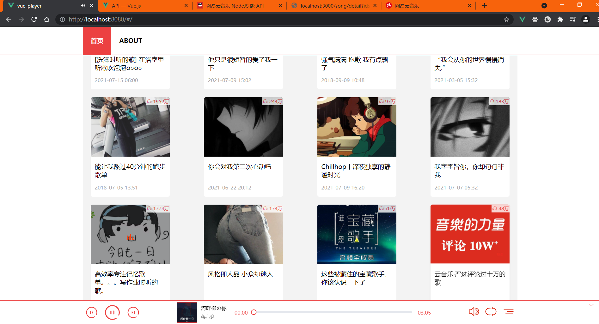

# vue-player
 
- 使用vue, sass, typescript编写，仿照网易云音乐的音乐网站（未完成）

- 后台数据使用: [Binaryify/NeteaseCloudMusicApi](https://github.com/Binaryify/NeteaseCloudMusicApi)

## 布局


## 安装项目依赖
```shell
npm install
```

### 在内存中以development模式运行服务
```shell
npm run serve
```

### 以production模式编译项目
```shell
npm run build
```

### 使用jest进行单元测试
```shell
npm run test:unit
```

### 语法检查
```shell
npm run lint
```